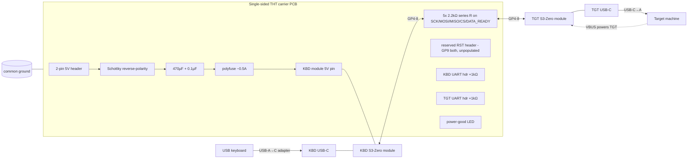

# Pcb Carrier Board Design

Spec: `pcb-carrier-board`
Status: design-approved
Created: 2026-08-18
Brainstorm: `./brainstorm.md`
Requirements: `./requirements.md`

## Summary

A single-sided, through-hole "carrier" PCB that mechanically and electrically
joins two socketed Waveshare ESP32-S3-Zero modules (KBD + TGT) into the kbdrelay
bridge, replacing the breadboard harness. USB stays on each module's USB-C
(keyboard → KBD USB-C via adapter; TGT USB-C → target). The carrier provides:
the SPI interconnect (with series resistors), KBD's protected 5 V power path
(series-Schottky reverse polarity → bulk cap → polyfuse), strict isolation of the TGT 5 V
domain, a power-good LED, per-module UART headers (with series resistors), and a
reserved (unpopulated) soft-reset header. Firmware is unchanged from v1.

Design tool: KiCad (single copper layer routed on the bottom; components +
wire-jumper links on top). All discretes through-hole.

## Goals and Non-Goals

### Goals

- Reproduce verified v1 behavior with socketed modules, no hand-wiring
  (FR-001..FR-005).
- Enforce the FR5 power rules and back-power protection by construction
  (FR-010..FR-013, FR-020..FR-026).
- Be etchable at home on a single copper layer with THT parts (NFR-001,
  NFR-006), while keeping the keyboard's VBUS within USB limits.

### Non-Goals

- Fab-house/production optimization, SMD, multi-layer, integrated USB
  connectors, enclosure — deferred to a future "product" spec.
- Any firmware change (soft-reset feature is only *reserved* in hardware).

## Architecture



- The carrier carries **power + SPI + GND + debug**, never USB data.
- **KBD** is powered by the carrier (from the 5 V header) and sources the
  keyboard's VBUS out its own USB-C. **TGT** is powered only by the target
  through its USB-C; the carrier does **not** connect to the TGT 5V pin.
- Both module USB-C ports face board edges for cabling.

## Schematic design (nets, values, candidate parts)

### Power path (KBD) — FR-010..FR-013, FR-020..FR-022

```
J_PWR(+5V) ──▶|── D_rev(1N5817) ──┬── C_bulk(470µF) ──┬── F_poly(PPTC ~0.5A) ── KBD.5V
                                   │   C_dec(0.1µF)    │
J_PWR(GND) ────────────────────────┴── common GND ─────┴───────────────────────── KBD.GND
```

- **Reverse polarity (series Schottky) — REVISED:** a plain **series Schottky
  diode**, anode → +5 V input, cathode → protected rail. Reversed input: the
  diode blocks → protected. This supersedes the earlier P-FET ideal-diode
  design, which is dropped for **sourcing reasons**: logic-level POWER P-FETs in
  THT (TO-220, Vgs(th) ≤2 V, Rds(on) ≤100 mΩ @ −4.5 V) are effectively
  unobtainable at hobby quantities, while Schottkys are on hand.
  Part: **1N5817** (1 A, 20 V, DO-41 axial); **1N5819** (40 V) is a drop-in.
  Symbol: `Device:D_Schottky`; footprint: `Diode_THT:D_DO-41_SOD81_P10.16mm_Horizontal`.
- **Voltage-headroom consequence (the one real cost):** at the expected ~0.3 A
  (KBD module + keyboard) the 1N5817 drops ≈**0.30–0.35 V** and the PPTC adds
  **0.06–0.14 V** (60R090), so a 5.00 V input lands the keyboard at
  ≈**4.5–4.6 V** — above the USB 4.40 V floor, but the margin is finite where
  the P-FET's was not. (With the originally-specified 0.5 A PPTC the worst case
  was 4.30 V, i.e. **out of spec** — that is what drove the 0.9 A revision.)
  Mitigations, in order of preference:
  1. Feed J_PWR from a **5.1–5.25 V** supply (a USB-C PD/5 V brick measures
     high anyway); this restores full margin.
  2. If a marginal keyboard appears, fit a **SB540/SB560** (5 A, DO-201AD,
     Vf ≈0.2–0.25 V at 0.3 A) — a larger axial part on the same 2-pad
     footprint pitch.
  3. Keep the rail trace short/fat (1.0 mm) so copper IR is negligible.
  **Layout note:** provide the diode pads with enough pitch/pad size to also
  accept a DO-201AD body, so the SB5x0 upgrade needs no board respin.
- **Verify at bring-up:** measure the protected rail and the keyboard VBUS with
  the highest-draw keyboard attached; **VBUS must read ≥4.40 V**.
- **Bulk cap:** 470 µF (≥10 V) radial electrolytic + 0.1 µF ceramic, placed at
  the KBD 5V pin — the validated fix for keyboard inrush brownout.
- **Polyfuse (REVISED — 0.5 A → 0.9 A hold):** radial THT PPTC in series to the
  KBD 5V pin, **Littelfuse 60R090** — hold **0.90 A**, trip **1.80 A**, 60 V,
  Rₘᵢₙ 0.20 Ω / R₁ₘₐₓ **0.47 Ω**, body 11.2 × 3.1 mm, leads on 5.08 mm centres.
  Supersedes the original ≈0.5 A / ≈1 A specification for two measured reasons:
  1. **Nuisance-trip headroom.** A USB device may legally draw **500 mA**; plus
     the KBD module (~60–80 mA) the legitimate load reaches **~0.58 A**. PPTC
     hold current derates with ambient (**83 % at 40 °C**), so a 0.5 A part
     holds only ~0.42 A in a warm enclosure and would trip on a legal keyboard.
     0.90 A derates to ~0.75 A — a **29 % margin** over 0.58 A.
  2. **Voltage headroom.** PPTC resistance scales inversely with hold rating.
     Worst-case drop at 0.3 A falls from **0.35 V (60R050, R₁ₘₐₓ 1.17 Ω)** to
     **0.14 V (60R090)** — 0.21 V handed back to keyboard VBUS, which is what
     makes the series-Schottky choice comfortable rather than marginal.
  Not taken any higher: at 60R110's 2.2 A trip a typical 5 V brick current-limits
  first, which would move protection from the fuse to the supply.
  Still satisfies FR-022 (passes ≥250 mA; clamps a short at 1.8 A).
- **TGT power:** the TGT module's 5V pin is **left unconnected** on the carrier.
  Only GND + SPI reach TGT → FR5.1/FR5.3 by construction.

### SPI interconnect — FR-002, FR-023

- Straight pin-to-pin between modules on the locked map, each line through a
  **2.2 kΩ series resistor** placed near the driving module:

  | Signal | KBD pin | TGT pin |
  |--------|---------|---------|
  | SCK    | GP4     | GP4     |
  | MOSI   | GP5     | GP5     |
  | MISO   | GP6     | GP6     |
  | CS     | GP7     | GP7     |
  | DATA_READY | GP8 | GP8     |

- Series R limits inter-module backfeed/latch-up and cures the power-up-order
  pre-charge; at ≤1 MHz the RC with short traces is negligible.

### Reset & flashing access — FR-030

- **The shared GP9 soft-reset node is REMOVED** (was: GP9 on both modules via
  1 kΩ each to an unpopulated 2-pin `RST_BTN` header). Dropped for two reasons:
  1. **It never satisfied FR-030.** FR-030 exists to support the *download-mode
     flashing sequence*, which requires the hardware BOOT+RESET sequence. A GP9
     line calling `esp_restart()` in firmware cannot enter download mode, and
     per the v1 bench notes a software/line reset over native USB does not even
     reliably restart the app.
  2. **It cost real routing space.** `RST_BTN` is a net spanning *both* modules,
     i.e. a full board-width run on a single-copper-layer board — a likely
     forced jumper, in exchange for a feature nobody would use on a prototype.
- **FR-030 is satisfied instead by the modules' own onboard BOOT and RESET
  buttons.** The S3-Zeros sit in sockets on the top face, so their buttons stay
  physically reachable. This makes it a **placement constraint, not a circuit**:
  → *Layout SHALL leave both modules' BOOT and RESET buttons operable with the
  boards seated — no tall neighbouring parts blocking finger/tool access.*
- **GP9 is left unconnected** on both modules (no-connect flags). Deliberately
  not broken out to pads either — on a single-sided board the routing cost is
  real and the feature is unused. Revisit only if a **two-layer** revision
  happens, where a shared reset node is nearly free to route.
- Consequence accepted: there is no one-button "reset both modules". Power-cycle
  J3 (KBD) or the target link (TGT), or press each module's own RESET.

### Debug UART — FR-026, FR-031

- Per module: **3-pin header (TX, RX, GND)**; **1 kΩ series R** on TX and RX so
  a plugged-in USB-UART adapter cannot back-power/sustain the module (the bench
  lesson). VCC intentionally absent from the header.

### Indication — FR-032

- One **power-good LED + ~1 kΩ resistor** across the protected 5 V rail.
- Per-role status remains on each module's onboard WS2812 (GPIO21).

## Connectors & pinouts (external interfaces)

- **J_PWR** — 2-pin (5V, GND) THT header; external 5 V source (user's choice).
- **Module sockets** — female 0.1" headers matching the S3-Zero (≈1×9 + 1×12
  per module); modules removable.
- **J_UART_KBD / J_UART_TGT** — 3-pin (TX/RX/GND) each.
- *(J_RST removed — see "Reset & flashing access".)*
- **USB** — not on the carrier; each module's USB-C, edge-accessible.

## Error handling → Fault & protection behavior

- **Reversed 5 V input:** series Schottky blocks; no current, no damage (FR-020).
- **Keyboard inrush:** bulk cap holds the rail; no brownout (FR-021).
- **Keyboard/cable short:** polyfuse trips, protecting source/board; resets when
  cleared (FR-022).
- **One module unpowered / any power-up order:** 2.2 kΩ series R limits backfeed
  so neither chip latches and an unpowered TGT still cold-starts cleanly when
  the target powers it (FR-023..FR-025).
- **Debug adapter attached:** 1 kΩ series on UART + no VCC pin prevents
  back-powering (FR-026).

## Security and Privacy → Target-hardware safety

- Not applicable in the software sense. The relevant safety property is
  **never sourcing power into the (possibly vintage) target**: guaranteed by
  leaving the TGT 5V pin unconnected and by the series-R'd SPI (only GND + weak,
  resistor-limited signals reach the TGT side). FR5.3.

## Testing Strategy

- **Bare-board checks:** visual/continuity — 5 V and TGT-5V domains isolated;
  GND common; SPI pin-to-pin; Schottky orientation (band = cathode = load side);
  polyfuse in series.
- **Power-on (no modules):** apply 5 V, verify protected rail ≈ input − ~0.3 V,
  power-good LED on; apply reversed 5 V, verify no rail.
- **Headroom check (loaded):** with the highest-draw keyboard running, measure
  keyboard VBUS — **must be ≥4.40 V**; if not, raise the supply to ~5.2 V or
  fit the SB5x0 alternate.
- **Populated bring-up:** install modules + v1 firmware; reproduce AC1–AC5
  (typing, Caps/Num LED, hot-plug, watchdog) — these are the acceptance tests.
- **Fault tests:** high-inrush keyboard enumerates first try; brief keyboard-VBUS
  short trips the polyfuse; verify all power-up orders (esp. KBD-first).
- No automated tests (hardware); `bridge_proto` host tests remain green as the
  firmware is unchanged.

## Rollout and Migration → Fabrication & assembly plan

- **Single copper layer** (bottom) routed in KiCad; components + **wire-jumper
  links** on top; **no plated vias**. Target **≤ ~8 jumpers**, each listed in
  build notes (NFR-001, NFR-006). **Achieved: zero jumpers** — see the layout
  amendment below.
- **Home-fab profile (starting targets, finalized in layout):** signal traces
  ~0.5 mm, power traces ~1.0 mm, clearance ~0.5 mm, drills ~0.9 mm with generous
  ~2 mm pads.
- **As-routed profile:** signal 0.7 mm, power/GND 1.5 mm, clearance 0.4 mm,
  module + PPTC drills 1.0 mm / 2.0 mm pads, all other parts library default.

### Layout amendment (2026-08-21) — as-built placement

Approved deviations recorded here per the "record deviations before
implementing" rule:

1. **Board is 88 × 55 mm, not 120 × 55 mm.** The first placement left ~30 mm of
   dead space between the middle cluster and the modules. Width came out of
   whitespace only; the arrangement from the user's sketch (modules at the short
   edges, USB-C exiting each end, discretes in the middle) is unchanged.
2. **The five SPI series resistors are one column, not two banks.** R1–R5 sit at
   x = 45 mm on a 5 mm row pitch (y = 34/29/24/19/14). The two-bank arrangement
   existed only to span the wider board and cost ~20 mm of width.
3. **TGT UART cluster moved with U2** (J2 at x = 60, R8/R9 rotated 180° so their
   module-side pad faces U2).
4. **The board is placed centred on the A4 drawing sheet** (origin 104.5, 77.5)
   rather than at the sheet origin, so the title block frames the board.
5. **4× M3 mounting holes** at the board corners, 3.5 mm in. The bottom-left
   hole's courtyard clips C1's body outline — mechanically fine, but use a
   low-profile screw/washer there.
6. **GND is a B.Cu pour with solid (not thermal-relief) pad connections**, plus
   three GND-only keep-clear channels. Without those channels the pour cannot
   reach C1.2, C2.2 and U2.2 once the +5 V and SPI runs wall them off — a
   silent, real fault that a pour alone hides.

**The "≥1 jumper is topologically forced" claim in tasks.md T-004 is wrong.**
It applied an annulus argument that ignores routing *around* a module and
*under* a module body between its two pad rows. The board routes with **zero
crossings on one layer**, so neither parked escape hatch (flipping U2 to the
back layer, or reversing TGT's SPI pin assignment in firmware) is needed, and
the design gate does not need reopening.
- **Outputs:** KiCad project, a 1:1 bottom-copper print for toner-transfer/home
  etch, and standard Gerbers for a PCB house.
- **BOM (all THT):** 1N5817 Schottky (SB540 alternate), 60R090 PPTC, 470 µF,
  0.1 µF, 5× 2.2 k (SPI), 4× 1 k (UART), LED + 1 k, J_PWR (1×2),
  2× UART (1×3), module socket headers. Board outline + 4× M3 holes.

## Requirements Traceability

| Requirement | Design Decision | Validation |
| ----------- | --------------- | ---------- |
| FR-001 | Two 0.1" module sockets (removable) | Bring-up: modules seat/run |
| FR-002 | SPI pins GP4–GP8 straight, series R | Continuity + typing works |
| FR-003 | Single common GND net | Continuity |
| FR-004 | No USB data on carrier | Layout review |
| FR-005 | Modules run v1 firmware | AC1–AC5 reproduced |
| FR-010/011 | 2-pin 5V header → protected → KBD 5V → keyboard VBUS | Meter + keyboard powers |
| FR-012/013 | TGT 5V pin unconnected; domains separate | Continuity (isolated) |
| FR-020 | Series Schottky (1N5817) reverse polarity | Reversed-input test + loaded VBUS ≥4.40 V |
| FR-021 | 470 µF + 0.1 µF bulk | High-inrush kb enumerates |
| FR-022 | 0.9 A / 1.8 A polyfuse (60R090) on keyboard VBUS | Short test trips fuse; no nuisance trip on a 500 mA keyboard |
| FR-023/024/025 | 2.2 kΩ SPI series R | Any power-up order works |
| FR-026 | UART 1 kΩ series, no VCC | Adapter can't back-power |
| FR-030 | Modules' onboard BOOT/RESET buttons kept accessible (placement constraint) | Press both buttons with modules seated; complete a download-mode flash in situ |
| FR-031 | Per-module UART header | Console works |
| FR-032 | Power-good LED | LED on with 5 V |
| FR-033 | USB-C edge access | Mechanical review |
| NFR-001/006 | Single-sided, jumpers, no vias | DRC + jumper list |
| NFR-002 | Cheap THT parts | BOM review |
| NFR-003 | Silkscreen labels | Layout review |
| NFR-004 | BOM + build notes | Docs present |
| NFR-005 | R/C values vs ≤1 MHz SPI | Typing reliable |

## Risks and Trade-offs

- **Schottky forward drop eats VBUS margin (accepted):** ~0.3 V at 0.3 A leaves
  the keyboard at ≈4.6 V vs the 4.40 V USB floor. Accepted in exchange for
  sourcing a part that actually exists in THT at hobby quantity. Mitigations:
  run J_PWR at 5.1–5.25 V; diode footprint accepts a lower-Vf SB540/SB560;
  bring-up explicitly measures loaded VBUS. Residual risk: a keyboard drawing
  well above 0.3 A (heavy RGB) could push VBUS toward the floor — such a
  keyboard is already near the polyfuse hold current and is out of scope.
- **(Superseded) P-FET ideal diode:** electrically better (near-zero drop) but
  logic-level THT POWER P-FETs proved unsourceable; small-signal TO-92 parts
  (VP2106/TP2104) are unusable here (ohms of Rds → >1 V drop, overheating).
  Revisit if the design ever moves to SMD.
- **Single-sided routing with two 21-pin modules + power:** may need several
  jumpers. Mitigation: place modules to keep SPI + power on the bottom layer;
  budget/document jumpers; the circuit is electrically simple.
- **No USB ESD on carrier:** data is on the modules; carrier can't add it.
  Accepted for the DIY board; revisit in the product version.
- **Keyboard current beyond polyfuse hold (RGB):** largely retired by the 0.9 A
  revision — a 500 mA keyboard plus the KBD module (~0.58 A) now sits ~29 %
  below the 40 °C-derated hold current. A keyboard drawing beyond USB's legal
  500 mA is out of scope and will still trip the fuse (best-effort per FR5.2).
