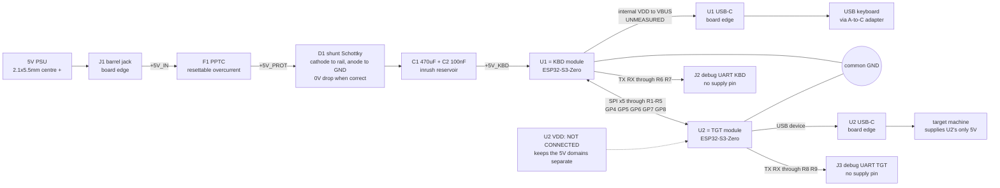

# PCB Carrier Board v0.2 Design

Spec: `pcb-carrier-v0-2`  
Status: design-draft  
Created: 2026-08-29  
Brainstorm: `./brainstorm.md`
Requirements: `./requirements.md`

## Summary

A two-layer, through-hole carrier PCB that sockets two Waveshare ESP32-S3-Zero
modules and joins them into the kbdrelay bridge. The board provides the five-wire
SPI interconnect with series protection, a common ground, a protected 5 V feed to
the KBD module only, and two debug UART headers. Three connectors reach the
outside world at board edges: each module's own USB-C, plus a 2.1 × 5.5 mm barrel
jack for power.

The single most consequential design decision is the **reverse-polarity
topology**, and it is settled by arithmetic rather than preference. FR-018 allows
a total of 0.60 V from the jack to the keyboard port at 500 mA. A series Schottky
(v0.1's answer) consumes roughly 0.40 V of that on its own, and the best
acceptable PPTC consumes another 0.29 V — **0.69 V, over budget before any copper
is drawn**. A shunt crowbar diode consumes **zero volts** in normal operation and
delivers the same protection, so v0.2 uses a shunt crowbar. This is the clearest
possible demonstration that v0.1's power path could not have met v0.2's
requirements, which is what a clean sheet is for.

One term in that budget has never been measured by anyone: the drop *inside* the
S3-Zero module, from its VDD pin to the VBUS pin of its USB-C connector. It could
plausibly be anywhere from a few millivolts of copper to a full Schottky drop if
the module carries a backfeed-blocking diode. Everything downstream of the
protection choice depends on it, so **D-004 makes measuring it a precondition for
layout**, not a bring-up surprise.

## Goals and Non-Goals

### Goals

- Meet the FR-018 voltage budget with measured evidence, not arithmetic alone
  (FR-018, D-004).
- Protect against reverse polarity at zero steady-state voltage cost (FR-013,
  FR-014).
- Produce a board manufacturable by PCBWay's standard 2-layer 1 oz service with
  zero DRC violations against their published rules (NFR-001, NFR-002).
- Make every non-module part orderable from one distributor by MPN (NFR-005),
  using stock KiCad footprints wherever one exists (NFR-006).
- Guarantee a single continuous ground region by construction and verify it
  (NFR-008).
- Keep documentation derivable from the board files rather than restated
  (NFR-013).

### Non-Goals

- Overvoltage protection. Deliberately excluded per EC-002.
- Any enclosure consideration beyond edge-mounted connectors (D-005).
- Firmware or pin-mapping changes (DC-001).
- Reuse of any v0.1 artifact (Overview, Out of Scope).

## Architecture

Three electrically distinct domains share one ground. The KBD domain is fed and
protected by this board; the TGT domain is powered entirely by the target machine
and this board deliberately supplies it nothing but ground and signals.



## Power Path Design

### Topology

```
J1.tip (+5V_IN) ── F1 (PPTC) ──┬── D1 cathode        ── C1 ── C2 ──┬── U1.VDD
                               │   (D1 anode to GND)               │
J1.sleeve ──────────────────── GND ────────────────────────────────┘
```

`D1` is reverse-biased and electrically invisible during normal operation. Under
reverse polarity it conducts, `F1` heats and trips, and the fault collapses to a
trickle; correcting the supply restores normal operation with nothing replaced
(FR-013, FR-014). `F1` must sit **upstream** of `D1` — that ordering is what lets
it interrupt the fault. `F1` simultaneously serves as the keyboard overcurrent
protection (FR-015), because U1 is the only load on the rail, so one part does
both jobs.

### Voltage budget (FR-018)

Allowance is 0.60 V total, from 5.00 V at the jack to 4.40 V at the keyboard
port, at 500 mA (D-003).

| Term | Worst case @ 500 mA | Basis |
|------|--------------------|-------|
| Barrel jack contact | ~0.015 V | typical contact resistance |
| F1 PPTC | **0.290 V** | Bel 0ZRE0100FF1A, R₁max 0.58 Ω (post-trip worst case; 0.22 Ω initial gives 0.110 V fresh) |
| D1 shunt crowbar | **0.000 V** | reverse-biased in normal operation |
| Board copper | ~0.020 V | short, wide 1 oz traces |
| Module socket contacts | ~0.020 V | two contacts in the path |
| **Subtotal on the carrier** | **~0.345 V** | |
| **Remaining for U1 internal VDD→VBUS** | **~0.255 V** | **UNMEASURED — see D-004** |

Rejected alternative, for the record:

| Topology | Protection drop @ 500 mA | Verdict |
|----------|--------------------------|---------|
| Series 1N5817 + 0ZRE0100 | 0.40 + 0.29 = **0.69 V** | **Fails FR-018** before copper |
| Series SB540 + 0ZRE0100 | ~0.30 + 0.29 = **0.59 V** | Fails once copper and sockets are added |
| **Shunt crowbar + 0ZRE0100** | **0.29 V** | **Selected** |

### PPTC selection trade-off

The Littelfuse 60R090 used in v0.1 is electrically *better* than the Bel Fuse
alternatives, but requires the hand-built footprint v0.1 created because the
stock Bourns footprint staggers its pads for kinked leads.

| Part | Hold | R₁max | Drop @ 500 mA | Stock KiCad footprint |
|------|------|-------|---------------|----------------------|
| Littelfuse 60R090 | 0.90 A | 0.47 Ω | 0.235 V | ✗ (hand-built) |
| **Bel 0ZRE0100FF1A** | **1.00 A** | **0.58 Ω** | **0.290 V** | ✓ `Fuse_BelFuse_0ZRE0100FF_L18.7mm_W5.1mm` |
| Bel 0ZRE0075FF1A | 0.75 A | 0.84 Ω | 0.420 V | ✓ |

**Selected: Bel 0ZRE0100FF1A**, preferring NFR-006's stock footprint at a cost of
0.055 V. The 0ZRE0075 is rejected outright — 0.42 V leaves nothing for the module.
If the D-004 breadboard shows the module's internal drop is large, the fallback is
to switch to the 60R090 and reinstate the hand-built footprint, buying back
0.055 V. A 0.5 A-class PPTC is not considered: v0.1 established that it derates to
roughly 0.42 A at 40 °C and would nuisance-trip a legal 500 mA keyboard.

### Inrush

`C1` = 470 µF electrolytic, `C2` = 100 nF ceramic, both immediately upstream of
U1.VDD (FR-017). This is the validated fix for the keyboard-inrush brownout
observed on v1 hardware (DC-008) and is carried forward deliberately.

## Schematic Design

### Net list

| Net | Members |
|-----|---------|
| `+5V_IN` | J1.tip, F1.1 |
| `+5V_PROT` | F1.2, D1.K, C1.+, C2.1, U1.VDD |
| `GND` | J1.sleeve, D1.A, C1.−, C2.2, U1.GND, U2.GND, J2.3, J3.3 |
| `SPI_SCK_K` / `SPI_SCK_T` | U1.GP4 → R1 → U2.GP4 |
| `SPI_MOSI_K` / `SPI_MOSI_T` | U1.GP5 → R2 → U2.GP5 |
| `SPI_MISO_K` / `SPI_MISO_T` | U1.GP6 → R3 → U2.GP6 |
| `SPI_CS_K` / `SPI_CS_T` | U1.GP7 → R4 → U2.GP7 |
| `SPI_DRDY_K` / `SPI_DRDY_T` | U1.GP8 → R5 → U2.GP8 |
| `UART_K_TX` / `UART_K_RX` | U1.TX → R6 → J2.1; U1.RX → R7 → J2.2 |
| `UART_T_TX` / `UART_T_RX` | U2.TX → R8 → J3.1; U2.RX → R9 → J3.2 |
| *(no net)* | **U2.VDD — explicitly no-connect (FR-012)**; U1/U2 3V3 and GPIO1,2,3,9,10,11,12,13 |

`U2.VDD` carries an explicit no-connect flag in the schematic so ERC records the
isolation as intentional rather than as an omission.

### Bill of materials

All through-hole (NFR-004). Modules are exempt from the sourcing rule (DC-007).

| Ref | Qty | Value / MPN | Footprint | Purpose / requirement |
|-----|-----|-------------|-----------|----------------------|
| U1, U2 | 2 | Waveshare ESP32-S3-Zero | `kbdrelay:ESP32-S3-Zero-Socketed` (project lib) | KBD and TGT (FR-001) |
| — | 4 | 1×9 female header 2.54 mm | part of module footprint | sockets (FR-002) |
| — | 4 | 1×9 male header 2.54 mm | — | soldered into module pad rows |
| J1 | 1 | CUI **PJ-102AH** (2.1 × 5.5 mm) | `Connector_BarrelJack:BarrelJack_CUI_PJ-102AH_Horizontal` | 5 V input (FR-011) |
| F1 | 1 | Bel Fuse **0ZRE0100FF1A** | `Fuse:Fuse_BelFuse_0ZRE0100FF_L18.7mm_W5.1mm` | overcurrent + crowbar interrupt (FR-015) |
| D1 | 1 | **1N5822** (3 A / 40 V Schottky) | `Diode_THT:D_DO-201AD_P12.70mm_Horizontal` | shunt crowbar (FR-013, FR-014) |
| C1 | 1 | 470 µF / 16 V electrolytic | `Capacitor_THT:CP_Radial_D10.0mm_P5.00mm` | inrush reservoir (FR-017) |
| C2 | 1 | 100 nF ceramic disc | `Capacitor_THT:C_Disc_D5.0mm_W2.5mm_P5.00mm` | HF decoupling |
| R1–R5 | 5 | 2.2 kΩ 1/4 W | `Resistor_THT:R_Axial_DIN0207_L6.3mm_D2.5mm_P10.16mm_Horizontal` | SPI series (FR-008) |
| R6–R9 | 4 | 1 kΩ 1/4 W | same | UART series (FR-022) |
| J2, J3 | 2 | 1×3 pin header 2.54 mm | `Connector_PinHeader_2.54mm:PinHeader_1x03_P2.54mm_Vertical` | debug UART, **no supply pin** (FR-020, FR-021) |

**Twelve distinct line items, all THT, all single-distributor.** No LED (D-001),
no mounting hardware (FR-005 withdrawn), no soft-reset header.

`D1` is a 3 A part rather than 1 A because it must survive the fault current until
F1 trips, and its forward drop sets the clamp voltage the modules see under
reverse polarity — lower is better. The DO-201AD 12.70 mm footprint accepts an
even beefier SB540/SB560 with no board change.

### Library plan

| Asset | Source | Rationale |
|-------|--------|-----------|
| Barrel jack, PPTC, resistors, caps, headers, diode | **stock KiCad libraries** | NFR-006 |
| ESP32-S3-Zero symbol + footprint | project library, vendored | no stock equivalent exists |

v0.1's hand-built `PPTC_Littelfuse_60R_P5.08mm` footprint is **not carried
forward** — the Bel Fuse part's stock footprint replaces it. The module footprint
remains the only hand-built asset, and its 1.0 mm drill / 2.0 mm pad gives a
0.50 mm annular ring against PCBWay's 0.25 mm minimum (DC-005), comfortably
compliant now that holes are plated.

## Layout Design

### Stack-up and rules

Two layers, 1 oz. **F.Cu carries signals; B.Cu is a solid, uninterrupted ground
pour.** This is the structural fix for v0.1's split-pour defect (F-6, NFR-008):
with all signal routing on the opposite layer, nothing can wall off a ground
region in the first place. Vias are available and unremarkable, so the entire
crossing/jumper problem that dominated v0.1 simply does not arise.

| Parameter | Value | PCBWay minimum (DC-005) |
|-----------|-------|------------------------|
| Signal trace | 0.30 mm | 0.127 mm |
| Power trace (`+5V_*`) | 1.00 mm | 0.127 mm |
| Clearance | 0.25 mm | 0.127 mm |
| Via | 0.6 mm pad / 0.3 mm drill | 0.5 mm / 0.3 mm |
| Track to edge | 0.40 mm | 0.30 mm |

Every figure sits at least 2× PCBWay's floor. There is no reason to crowd their
limits: this design has enormous area headroom, and margin costs nothing.

### Placement

- **U1 (KBD) at the left edge, U2 (TGT) at the right edge**, USB-C connectors
  overhanging their respective board edges via the footprint's 1.5 mm notch
  (FR-003, DC-003).
- **J1 barrel jack on the front long edge, near U1** — keeps the high-current
  path short and puts power next to the module it feeds (FR-011).
- Power chain F1 → D1 → C1/C2 clustered between J1 and U1.VDD.
- R1–R5 in a single column mid-board between the two modules.
- J2 near U1, J3 near U2, both reachable from above.
- **No board-mounted component may obstruct either module's BOOT/RESET buttons**
  (FR-004) — this is a placement rule, checked visually against the module
  outline.

**Outline: minimise, bounded by hand-assembly access (NFR-003, NFR-016).** The
100 × 100 mm figure is a cost bracket, not a target, and is expected to be
non-binding. v0.1 needed 88 × 55 mm largely because single-sided routing forced
parts apart; two layers plus the deleted LED and mounting holes remove that
pressure, so **≈ 70 × 45 mm is a plausible projection and not a commitment**.
The outline is an output of layout (D-005).

The binding constraint on shrinking is NFR-016, and the parts that set it are
the physically large ones: C1 (10 mm diameter can), F1 (18.7 mm body), D1 on a
12.70 mm pitch, and J1's barrel-jack body. Layout must keep an iron path to
every joint with neighbours already fitted — in practice this means the power
cluster, not the resistor field, sets the minimum area. Verified on the
assembled board per AC-15, because CAD clearance and iron access are not the
same check.

### Ground continuity

B.Cu is a single pour with no signal routing to fragment it. Verification is
mechanical, not visual: a script loads the board through `pcbnew`, fills zones,
and asserts the GND zone resolves to exactly **one** connected region with zero
unconnected items — the check v0.1 lacked when it shipped a silently split pour.

## Error Handling

Hardware equivalents — how each fault presents and recovers.

| Fault | Behaviour | Recovery | Ref |
|-------|-----------|----------|-----|
| Reverse-polarity supply | D1 conducts, F1 trips, rail collapses | Correct supply; F1 self-resets | FR-013, FR-014 |
| Keyboard short or overcurrent | F1 trips | Remove fault; F1 self-resets | FR-015, EC-003 |
| Wrong-voltage supply (12/19 V) | **Modules destroyed** | None — deliberately unprotected | EC-002 |
| High-inrush keyboard | C1 supplies surge; no brownout | Automatic | FR-017 |
| Peer module unpowered | Series R limits backfeed; no latch-up | Automatic | FR-008, FR-009 |
| Powered debug adapter on unpowered module | Series R limits injected current | Automatic | FR-022, EC-006 |
| Sagging supply | VBUS falls; keyboard may misbehave | Use a supply that holds 5.00 V | EC-007 |
| Keyboard over 500 mA | F1 trips rather than sagging indefinitely | Use a lower-draw keyboard | EC-008 |

## Testing Strategy

Ordered by when each gate runs. **The breadboard gate precedes layout** — that
ordering is the whole point of D-004.

1. **Breadboard power-path validation (precondition for layout, D-004).**
   Build J1 → F1 → D1 → C1/C2 → module on a breadboard. At exactly 5.00 V input
   and 500 mA load, measure and record: voltage at the jack, at U1.VDD, and at
   the keyboard VBUS. This yields the unmeasured module internal drop and
   confirms or refutes the FR-018 budget **before** any copper is committed.
   Also verify reverse polarity trips F1 and self-recovers. Records per NFR-014.
2. **Schematic gate.** `kicad-cli sch erc` → zero violations (NFR-007). U2.VDD
   confirmed no-connect.
3. **BOM gate.** Every non-module line item confirmed in stock at one
   distributor with an MPN (NFR-005, AC-12).
4. **Layout gate.** `kicad-cli pcb drc` against the vendored PCBWay `.kicad_dru`
   → zero violations (NFR-002). Ground-continuity script → exactly one region
   (NFR-008, AC-11). Both are commands, not opinions.
5. **Bare-board bring-up.** Continuity on all five SPI lines through their
   series resistors; GND common; **U2.VDD isolated from the rail**; deliberate
   reverse-polarity application; keyboard-port short. (AC-3, AC-4, AC-5, AC-6)
6. **Populated bring-up.** Seat modules, reflash in situ via module buttons
   (AC-2), measure and **record** loaded keyboard VBUS ≥ 4.40 V (AC-7), all
   power-up orderings (AC-8), powered debug adapter on an unpowered module
   (AC-9).
7. **System acceptance.** v1 firmware reproduces v1 AC1–AC5: typing, Caps/Num
   LED backchannel, hot-plug, watchdog (AC-13).
8. **Reproduction gate.** A board is built following only the repo docs, with no
   undocumented steps (AC-14).

## Rollout and Migration

No migration exists — this is new hardware, and v0.1 is frozen at tag
`v0.1-board`. v0.2 lives in a new KiCad project directory so no v0.1 file is
touched or overwritten. Firmware is unchanged, so a v0.1 board and a v0.2 board
run identical binaries.

Fab outputs go to exactly one canonical directory, versioned in the filename
(NFR-010, NFR-011) — the v0.1 failure where the board of record was named
`test2` while a stale, DRC-failing layout held the canonical name.

## Requirements Traceability

| Requirement | Design Decision | Validation |
|-------------|-----------------|------------|
| FR-001 | Two S3-Zero module positions, U1/U2 | AC-1 |
| FR-002 | 4× 1×9 female socket strips | AC-1 |
| FR-003 | Modules at left/right edges, USB-C over the 1.5 mm notch | AC-1 |
| FR-004 | Placement rule: nothing obstructs BOOT/RESET | AC-2 |
| FR-006 | R1–R5 between matching GP4–GP8 pins | AC-3 |
| FR-007 | U1.GND, U2.GND on the B.Cu pour | AC-3 |
| FR-008 | 2.2 kΩ series per SPI line | AC-3 |
| FR-009 | Series R limits backfeed into an unpowered peer | AC-3, bring-up |
| FR-010 | No sequencing element in the design | AC-8 |
| FR-011 | J1 = CUI PJ-102AH at the front edge | AC-1 |
| FR-012 | U2.VDD explicit no-connect | AC-4 |
| FR-013 | D1 shunt crowbar + F1 upstream | AC-5 |
| FR-014 | PPTC self-resets; no fusible parts | AC-5 |
| FR-015 | F1 = 0ZRE0100FF1A, 1.0 A hold | AC-6 |
| FR-016 | Silkscreen `5V ⏜ centre +` at J1 | visual |
| FR-017 | C1 470 µF + C2 100 nF at U1.VDD | AC-7 |
| FR-018 | Budget table; crowbar chosen to fit it | **breadboard (D-004)** then AC-7 |
| FR-020 | J2, J3 1×3 headers | AC-9 |
| FR-021 | No supply net on J2/J3 | AC-9 |
| FR-022 | 1 kΩ series per UART line | AC-9 |
| NFR-001 | 2-layer 1 oz, all rules ≥2× PCBWay floor | AC-10 |
| NFR-002 | Vendored `.kicad_dru`, DRC gate | AC-10 |
| NFR-003 | Minimise outline; 100 × 100 mm cost bracket non-binding | measure outline |
| NFR-016 | Power-cluster spacing sets minimum area; iron access preserved | AC-15 |
| NFR-004 | Every part THT | BOM review |
| NFR-005 | 12 line items, one distributor, MPNs listed | AC-12 |
| NFR-006 | Stock footprints for all but the module | BOM review |
| NFR-007 | ERC gate | AC-10 |
| NFR-008 | Signals on F.Cu only; solid B.Cu pour; scripted region check | AC-11 |
| NFR-010 | Single canonical `fab/` directory | file review |
| NFR-011 | Version in filenames and silkscreen | file review |
| NFR-012 | BUILD.md written for a stranger | AC-14 |
| NFR-013 | As-built table generated from the board file | doc review |
| NFR-014 | Measurements recorded at breadboard and bring-up | AC-7 |

## Risks and Trade-offs

- **The module's internal VDD→VBUS drop is unknown and could break the budget.**
  It has roughly 0.255 V of headroom. If the S3-Zero carries a backfeed-blocking
  Schottky on its 5 V path, that alone could consume all of it. *Mitigation:*
  D-004 measures it before layout. *Fallbacks, in order:* switch F1 to the
  Littelfuse 60R090 (+0.055 V, costs a hand-built footprint); accept a
  documented supply above 5.00 V (contradicts D-003, so a requirements change,
  not a design tweak); bypass the module's 5 V path entirely by feeding keyboard
  VBUS from the carrier — which is not possible, since USB is only available at
  the module connector (DC-002). **The third fallback not existing is why this
  measurement gates layout.**
- **The crowbar relies on F1 tripping rather than blocking current outright.**
  A series diode fails safe by construction; a crowbar fails safe by dynamics.
  With a current-limited bench supply F1 may never trip, leaving D1 forward-
  biased and dissipating — nothing downstream is powered and nothing is damaged,
  but it is a "stuck" state rather than a clean cutoff. *Accepted:* the outcome
  is safe in every case; only the mechanism is less absolute.
- **Overvoltage remains unprotected** (EC-002). Deliberate. Silkscreen and
  documentation are the only mitigations.
- **Bel Fuse PPTC costs 0.055 V versus the Littelfuse part** purely to satisfy
  NFR-006. If the budget turns out tight, this is the first thing to trade back.
- **Compactness and assembly ease pull against each other.** NFR-003 wants the
  smallest board; NFR-016 wants iron access with neighbours fitted. The large
  THT parts (C1, F1, D1, J1) mean the power cluster dominates the minimum area,
  so shrinking the signal side buys little. *Mitigation:* NFR-016 explicitly
  wins, and AC-15 checks it on real hardware rather than in CAD. The 70 × 45 mm
  figure is a projection, not a commitment.
- **No impossibility claims appear in this document.** v0.1 produced two, both
  later disproved by hand. Where this design says something cannot be done —
  board-mounted USB, board-mounted BOOT/RESET — it is because the module does
  not expose the pins (DC-002), which is a fact about the part, not a failed
  search.
